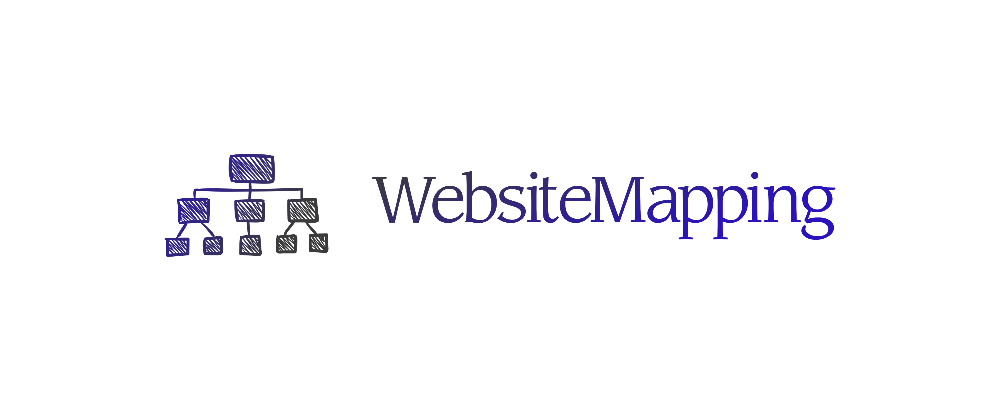

# logo.websitemapping.com

        Font in use <a target="_blank" href="http://www.yoworks.com/midiet/index.html">Midiet_Serif_Light</a> designed by
        <a target="_blank" href="http://www.yoworks.com/">Yamaoka Yasuhiro</a>
        and licensed under
        <a target="_blank" href="https://www.fontsquirrel.com/license/midiet">Freeware.</a>
          Icon Designed by
          <a target="_blank" href="https://thenounproject.com/xela.">Xela Ub</a>

Font
  
    #929292, #2B90B9
    #3B3B3B, #2A13BD

Background
    
    transparent

Icon
    
    #08728C, #6D6D6D
    #2A13BD, #3B3B3B
    

    

## 1

## 2

## 3

## 4

## 5

## 6

---

+ [edit](https://github.com/websitemapping/logo/edit/main/README.md)
+ [websitemapping/logo/](https://github.com/websitemapping/logo/)
    
    
    
